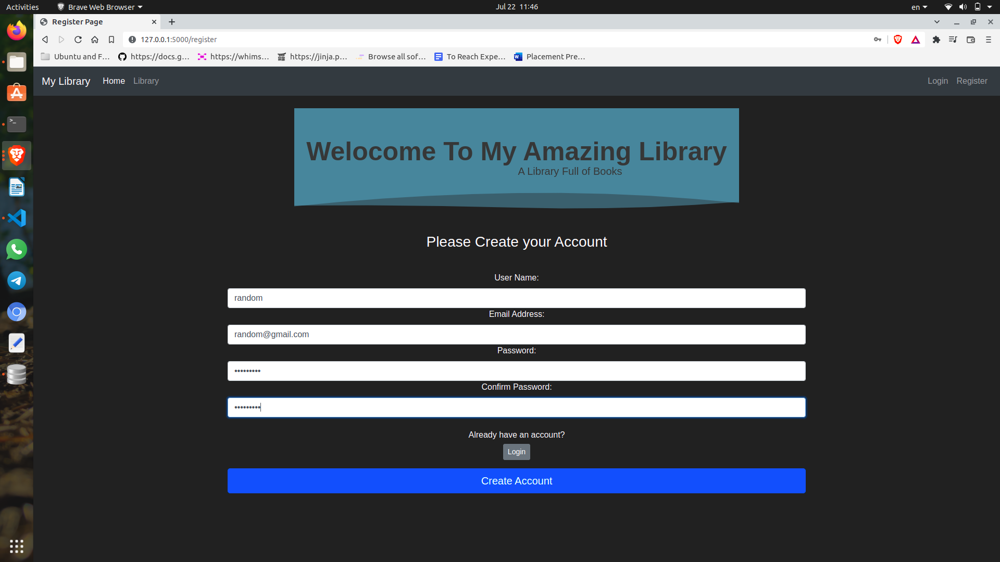
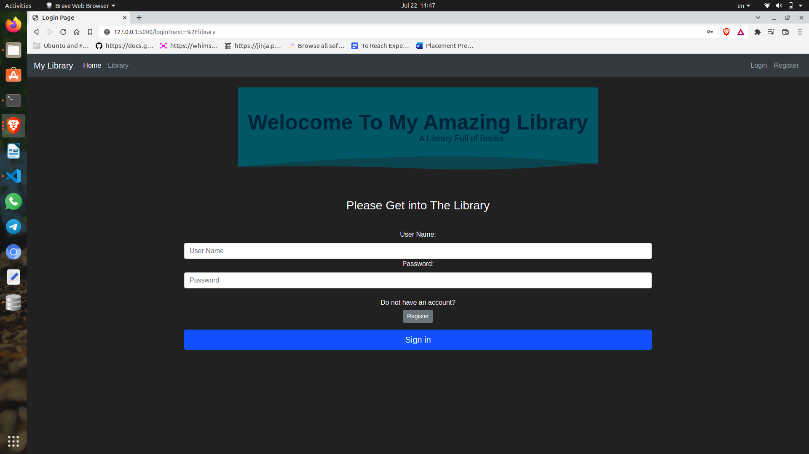
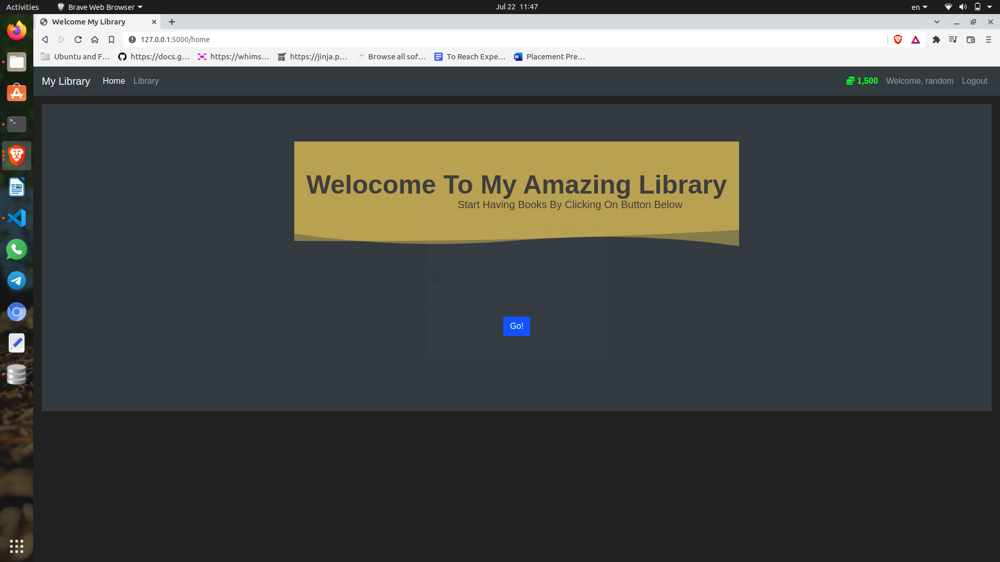
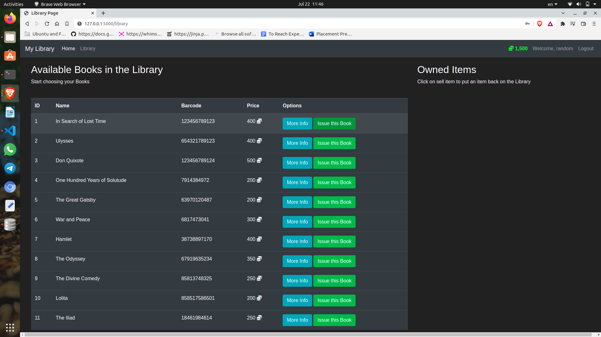

# Library-Management

Website to manage library.

## Tech Stack
### Frontend:
* HTML
* CSS

### Backend+db (preferred):
* Flask
* SQLite

## Components

### Login and Register
User have to register and login first to access the web.

### Issue Book
User can select a book to issue and if the user has enough coins associated to the book, the book will be issued.

### Submit Book
User can submit the book any time and the coins associated to the book will be transfered to the user account which can be used later to issue different books.

### Coin System
Every user is given fix number of coins initially, which can be used to used to get different book. Each book has assiciated with some amount of coins.

## Screenshots

| | |
|:-------------------------:|:-------------------------:|
| | |
|  |  |

## Contributors :trophy:

